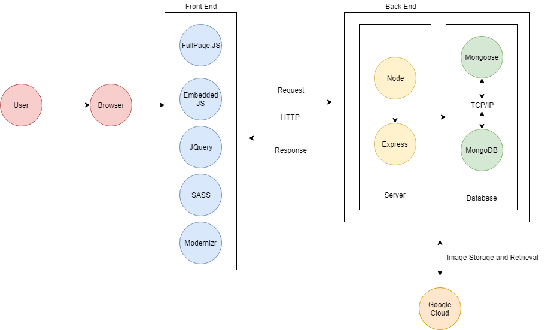
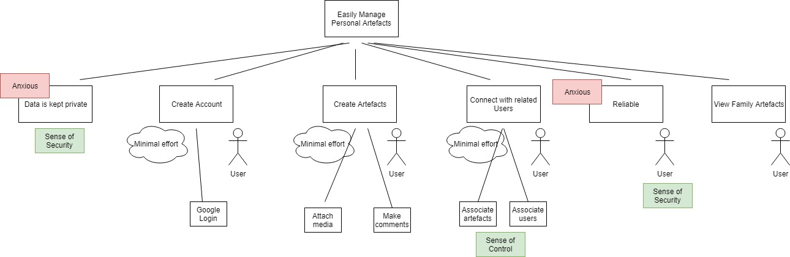
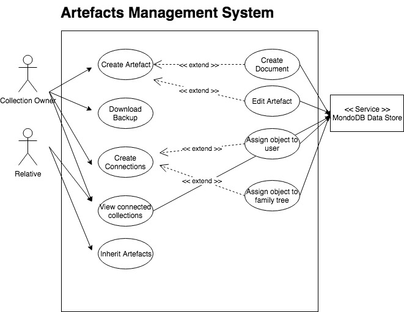
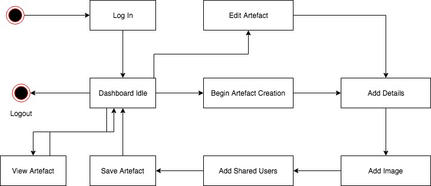

## Software Architecture Diagram

### Description

This architecture model describes the frameworks we used to create our application. You can see the reasons we used all of these under the Vendors section on the [homepage](https://kanetesta.github.io/IT-Project/index.html).

## Goal Model

### Description

This Goal/Motivation model. It attempts to reflect the user requirements for the application, including emotions and preferences of the users, and basic use cases. The key focus of our application is to securely create an account that can store artefacts of sentimental value to a person/persons, that are sharable. These use cases are reflected in the model

## Use Case Diagram

### Description

Much like the goal model, this use case diagram intends to reflect the application to help create a visual reference for those who would not understand a technical blueprint such as the software architecture model. As you can see, the 3 key actors are the collection owners, connections to these collection owners and the data store.

## State Machine Diagram - User Dashboard

### Description

This state machine diagram demonstrates each state a user can be in upon login, and where each state leads to. As above, you can see that the edit and create artefacts lead the user down a similar path. If you open the dashboard on the application, it is easy to tell what stage resonates with each of the above stages, which includes the ability to have read only priveledges on shared artefacts.
