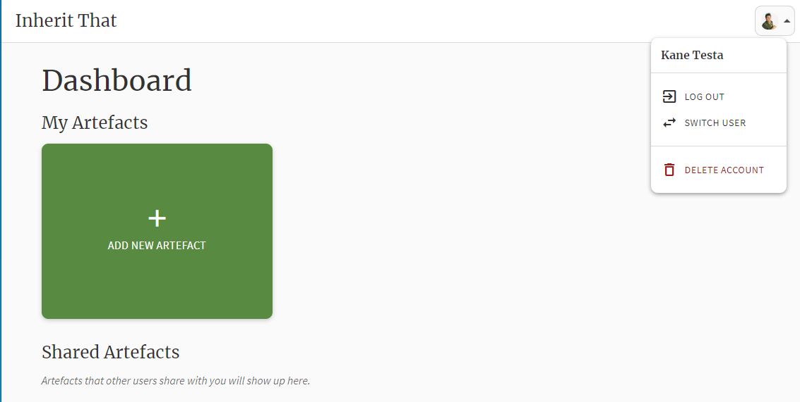
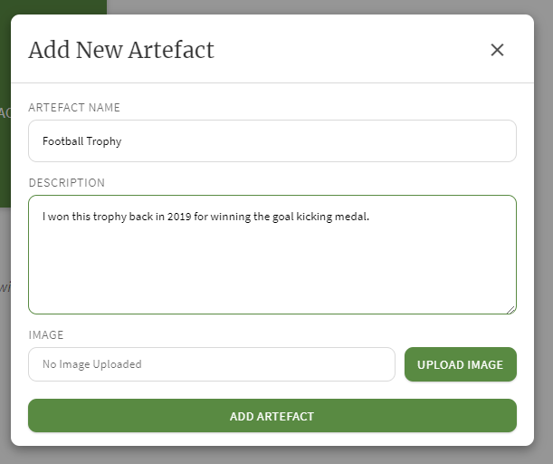
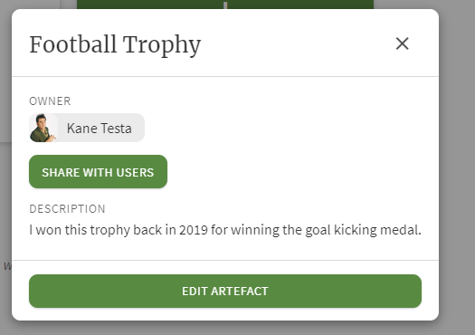
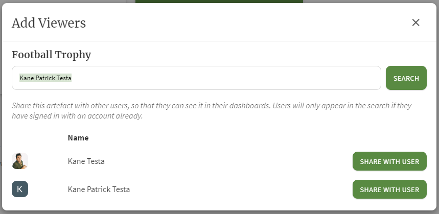
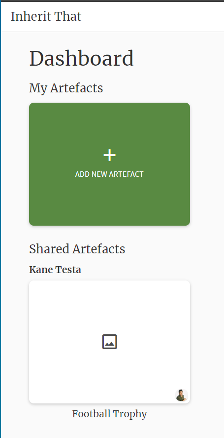
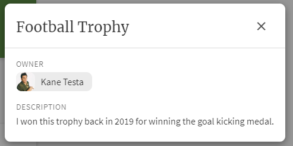

## Motivation

The motivation for creating a tagging system comes from the following user stories.

As a creator of a family artifact database I want to be able to keep track of my physical artefacts with monetary or sentimental value, in order to assist in the creation of my will.
As a user I want to be able to view all the artifacts associated with my family on one central page, so that they are easy to find and browse.
As a creator of a family artifact database I want to be able to allow other users to view my artifacts, but to limit the amount of information available to them so that I can avoid family conflict.
As a creator of a family artifact database I want to be able to attach documents to my artefacts, such as receipts, documents of worth, value and authenticity in order to better track the worth of each object.
As a user I want to be able to attach documents to myself, such as a diploma, birth certificate or insurance information so that I can have a digital record of it.
As a creator of a database I want to be able to assign certain objects to other user for posterity, without disclosing this decision to them.
As a user I want to be able to take photographs of an object on my phone and be able to upload these to the application when I create a new artifact.
As a user I want to be able to enter information for an object, such as a description, the object’s origin, any documentation and any insurance on the object.
As a user I want to be able to connect my database to an existing family tree and be able to associate object with a specific person.
As a user I want the user interface to be simple to navigate, so that aging users unfamiliar with digital technology can use the app.
As a creator of a database I want to be able to allow an executor of my will to access the database in the case of my demise.

Artefact management is the core functionality of the application, hence why it appeals to multiple user stories. The following will provide an explanation of all the functionalities to do with artefact creation and sharing.

## Dashboard

The dashboard is where a user is redirected to upon logging in. All the main interactions with the applications occur from this page. This page will be quite empty upon registration.

Note how you can use the top right icon (which will show your personal display picture) to open a navigation bar providing you the option to log out, switch user or delete your account. Deleting your account will delete all a user's artefacts also.

## Adding Artefacts
Upon adding artefacts, a user will be prompted to enter a name and description for the object. These are the two mandatory fields. You can also opt to add supporting images from one of two methods. Either uploading them from a user's device, or using the camera attached to a user's device. This/these artefact's will now be added to the user's dashboard. The owner can then select to share this artefact with other users once it has been created.

## Sharing Artefacts
Once an item has been created, a user can select to share with another registered user. This user can be found by searching for them when prompted, after clicking the "Share with users" button as shown below. The user who has had an item shared with them can now see this artefact in their dashboard under the "Shared Artefacts" section. This user can only see the artefact's information and who the owner of the artefact is, meaning that other users that the item is shared with are hidden.

Sharer:

User item is shared with's dashboard:

