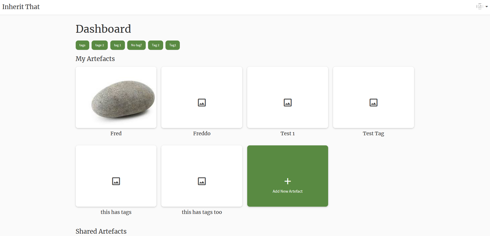

##Motivation

The motivation for creating a tagging system comes from the following user stories. Specifically, the clients desire for artefacts to be stored on a central page, be easy to browse and support the capabilities of aging users.
As a user I want to be able to view all the artefacts associated with my family on one central page, so that they are easy to find and browse.

As a user I want the user interface to be simple to navigate, so that aging users unfamiliar with digital technology can use the app

The implementation of a tagging system will aid in achieving these user stories. Since the client has a large number of artefacts there needed to be a way to navigate the items stored in the app in a way that was user friendly and intuitive. By giving each item several tags they can be sorted into categories for ease of browsing. Furthermore, a dictionary of distinct tags can be generated and displayed as buttons for a user to interact with. When the button is pressed the displayed artefacts will be filtered by the selected tag allowing users with limited technological know how to use the system with the press of a button. 

## Functionality
The tags will be displayed above the artefacts. Each correspond to exactly one category. Artefacts may have any number of tags added to them when they are created, and more may be added later. When a tag is pressed it will be highlighted and the artefacts that have the same tag will be shown, the others will be hidden and reloaded when the tag is deselected. 
