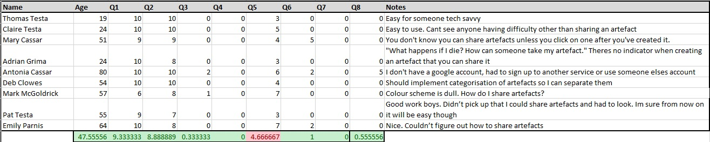

Observational testing was undertaken for reasons surrounding the quality, usability and features of the product. The co-operative observational querying method was used to do so. First, I gave testers a brief look at the home page of the website and asked what they thought the website was. Then, the user was given notes to read through including the requirements and user stories page,to clarify the purpose of the application. The testers were then told to navigate through the application without any assistance in an attempt to validate the ease of use. The instructions were to figure out how to upload and share an artefact without assistance, and then delete their account. The users each had an artefact shared with them when they created an account.

A questionnaire was then filled out by each user and the results are as per below. Each user had to score the following questions out of ten:

- Q1 - How suited is the colour scheme given the theme of the application?
- Q2 - To what extent is the topic of the website evident from the home screen?
- Q3 - How difficult to find were the core functionalities of the website? (0 Very Easy - 10 Impossible)
- Q4 - How difficult was it to learn how to upload your artefacts?
- Q5 - How difficult was it to share the artefacts with another user?
- Q6 - How difficult was it to delete your account?
- Q7 - How difficult was it to view the details of an item shared with you?
- Q8 - How difficult was it to log in?
- Notes

Key recommendations from the testing coincedentally asked for functionalities that we are implementing in Sprint 3.